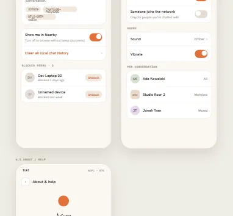

# Agora — UI Design Preview

**Agora** is a LAN-first chat and calling app: find people on the same WiFi network and talk to them instantly — no accounts, no phone numbers, no internet connection required. Discovery, messaging, file sharing, and voice/video calls all work directly, device‑to‑device, over the local network. Internet, when it happens to be available, is treated as a pure bonus (optional cross‑network sync) — never a requirement.

This repository holds the **visual design** for Agora: a single interactive canvas covering all 37 screens of the app, from onboarding through calls, settings, and file sharing.

## View it

Open [`index.html`](index.html) in any browser — it's a self-contained page (no build step, no install).

## What's designed here

| Section | Screens |
|---|---|
| **Onboarding** | Splash, permissions (with plain-language reasons for each), profile setup (no sign-up), first-run network check (found / empty / blocked states) |
| **Nearby** | Live peer list with presence indicators, empty/scanning state, peer quick-actions, discovery troubleshooting |
| **Chats** | Conversation list, 1:1 chat with delivery ticks, group chat, new chat/group creation, per-conversation info |
| **Calls** | Outgoing/incoming call, call collision handling, active audio/video call, call-ended summary, call history |
| **Settings** | Network mode (LAN-only vs. hybrid), privacy & security, notifications, about/help |
| **System states** | Connectivity change banners, router (AP) isolation detected, peer disconnected mid-call |
| **File sharing** | Send confirmation, transfer progress, a distinct security interstitial for installable files (APKs, etc.), shared-files list |

## Design direction

- **Mood:** warm and local — "same room," not corporate cloud software.
- **Palette:** warm cream neutrals with a terracotta accent, standing in for presence/signal rather than a cold tech blue.
- **Type:** Instrument Serif for display headings, Hanken Grotesk for interface text, IBM Plex Mono for technical/metadata labels.
- **Signature motif:** a recurring "presence pulse" used anywhere a peer is shown as reachable right now — since the entire value of the app is "who can I actually talk to on this network."

## Why this matters for the app itself

Every screen here is tied to a concrete part of how Agora actually works underneath — for example, the peer list reflects live mDNS/UDP discovery results, delivery ticks map to a real send → sent → delivered acknowledgment protocol over direct WebSocket connections, and the file-sharing security interstitial exists because installable files (APKs, executables) are treated as a genuine security decision, not a routine download. This design isn't decoration bolted onto a backend afterward — the backend (peer discovery and LAN messaging) is being built in step with it, and is already working end-to-end in testing.
