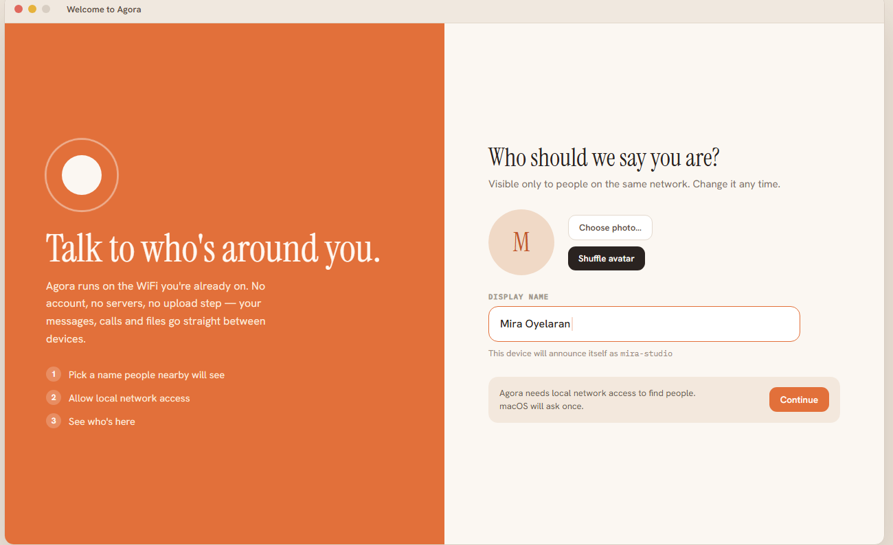
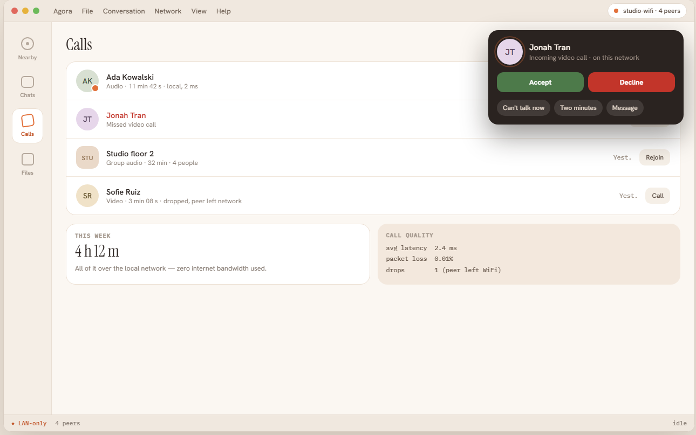
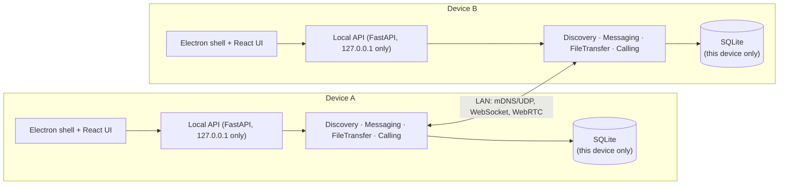
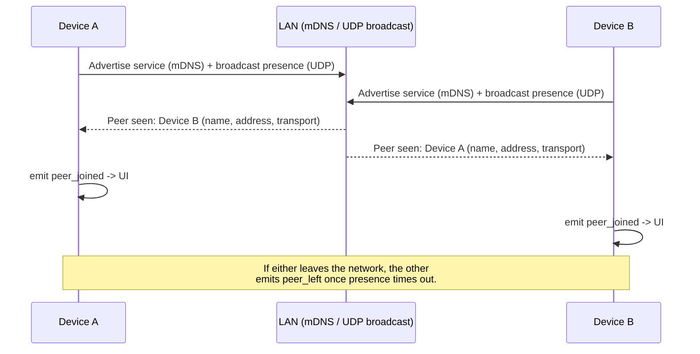
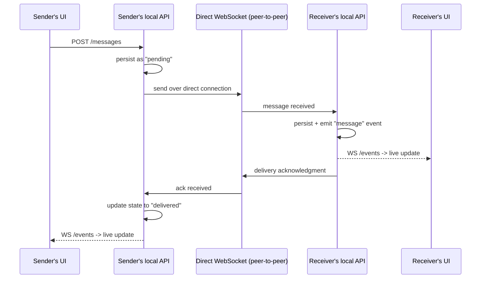
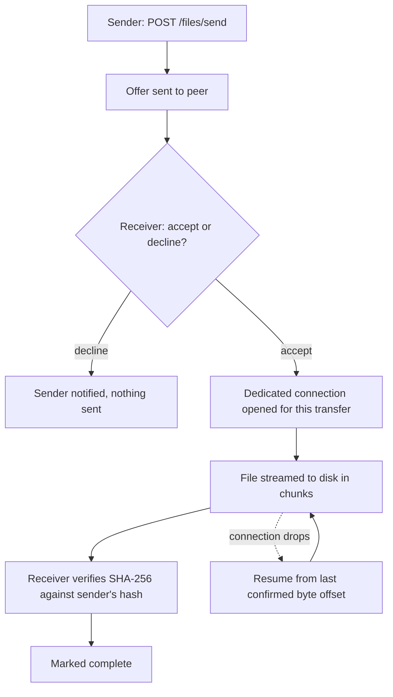
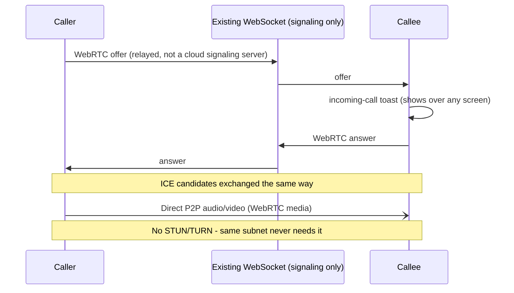
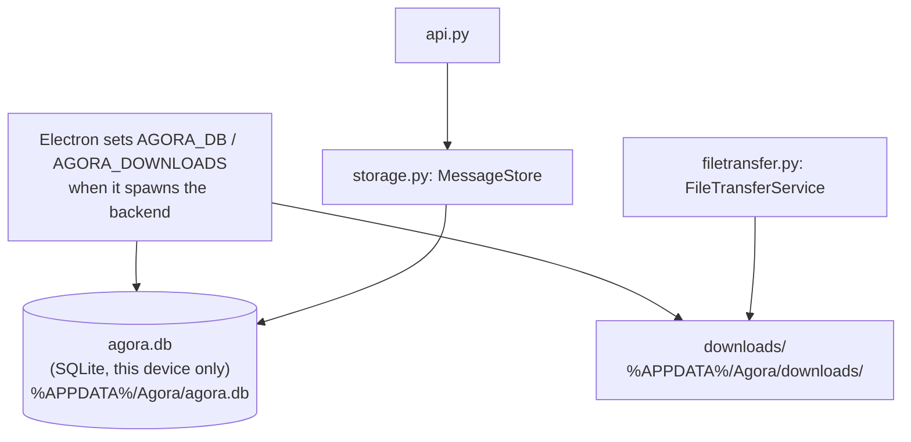
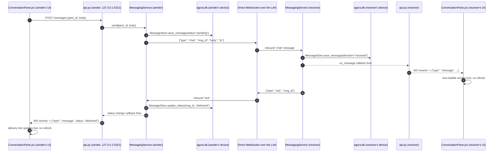
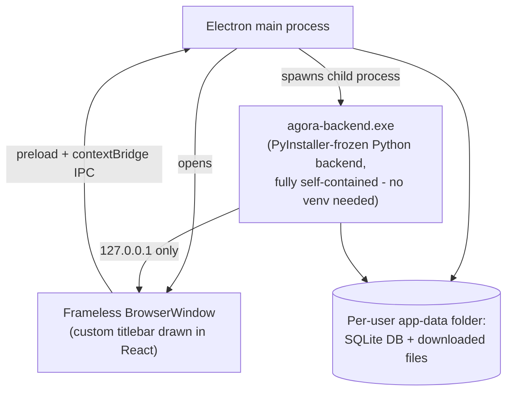

# Agora

**Agora is not "another messaging app."** It's private, serverless, local communication for places where internet connectivity, privacy, or account-based communication is undesirable or unavailable. Find people on the same local network and talk to them instantly: no accounts, no phone numbers, no internet connection required. Discovery, messaging, file sharing, and voice/video calls all work directly, device‑to‑device, over the local network. Internet, when it happens to be available, is treated as a pure bonus (optional cross‑network sync), never a requirement.

**Where this fits:** campuses and classrooms, conferences, airplanes, hospitals during a network outage, disaster/emergency response, remote sites (construction, camps, villages), factories and warehouses, LAN parties, and any privacy-sensitive gathering where a central server is a liability, not a feature.

This repository holds the **visual design** (a single interactive canvas covering all 37 mobile screens plus a dedicated desktop section), the **working backend** for the phases built so far, and a **real desktop app** (React UI rebuilt to match the actual design file pixel-for-pixel, running inside Electron with the Python backend spawned automatically, not a browser tab, not mockups).


## Why "Agora"

In ancient Greek city-states, the *agora* was the open public square: the place people physically gathered to talk and trade, with no ruler or central authority presiding over it. That's the shape of this app: no server sitting in the middle of your conversation, no account system, no company routing your messages through its own infrastructure. Just people finding each other in the same local space, here the same WiFi network, and talking directly, the way the agora itself worked: a local gathering place, not a cloud platform.

## View the design

Open [`design/index.html`](design/index.html) in any browser. It's a self-contained page (no build step, no install).

## Desktop app design

The plan is an Electron shell around this same design, talking to the local API (see Build status below): a full native-feeling window, not a resized phone screen:





## Run the backend

```bash
cd backend
python -m venv venv && venv\Scripts\activate   # or: source venv/bin/activate
pip install -r requirements.txt

# terminal 1
python -m app.cli_chat --name Alice --port 8001
# terminal 2
python -m app.cli_chat --name Bob --port 8002
```

Once both are running, type `peers` in either one to see the other appear on the network, then `Bob hey` (or `Alice hey`) to send a message, then `history Bob` to watch it move from `pending` → `sent` → `delivered`. Try `send Bob <file path>` too: the other side gets a live accept/decline prompt (with a distinct warning if it's an executable), and `files Bob` shows transfer status. No server, no config: the two processes find and talk to each other directly.

There's also a local HTTP/WebSocket API (`app.api`) for driving this programmatically instead of through the CLI: `uvicorn app.api:app --host 127.0.0.1 --port 5001` exposes `GET /peers`, `POST /messages`, `POST /files/send`, and a `WS /events` stream. This is what the desktop UI below actually talks to.

## Run the desktop app

The real thing - a frameless Electron window with its own custom titlebar, spawning the Python backend automatically. No terminal to babysit, no browser tab.

```bash
cd frontend
npm install
npm run electron:dev
```

That's it - Electron starts the backend for you (writing its data to a proper per-user app-data folder) and opens the real app window. `npm run electron:build` produces a Windows installer via electron-builder.

Prefer just the web UI in a browser tab for development? That still works:

```bash
cd frontend
echo VITE_API_BASE=http://127.0.0.1:5001 > .env
npm run dev
```

(with a backend already running on port 5001 via `app.api`, as above).

## Build status

This repo is the design; the app itself is being built in step with it, phase by phase. Current status:

| Phase | Status | Design screens |
|---|---|---|
| 1: Discovery | ✅ done | 1.1–1.4c (onboarding), 3.1–3.3 (nearby) |
| 2: Messaging | ✅ done | 4.1–4.5, 7.2 |
| 2B: File sharing | ✅ done | 8.1–8.7 |
| 3: Calling | ✅ done | 5.1–5.6, 5.2b, 7.3, 7.4 |
| 4: Hybrid mode | ❌ removed by design (LAN/WiFi-only, always; internet availability is never checked) | ~~6.2, 7.1~~ |
| 5: Polish | ⏳ not started | 6.1, 6.3–6.5 |

- **Discovery**: devices find each other on the LAN via mDNS, with a UDP broadcast fallback for networks that filter it. Verified: peers appear/disappear live as they join and leave.
- **Messaging**: direct WebSocket between peers (no server in between), messages persisted locally per device, with sent/delivered acknowledgment. Verified: a message sent to a peer that just dropped off the network is held and delivered exactly once, in order, once that peer reappears.
- **File sharing**: any file type, offer/accept consent before anything moves, a dedicated connection per transfer so large files stream straight to disk, receiver-side hash verification, and resume from the exact byte offset after a drop. Executable/installable files get a distinctly stronger warning, plus bandwidth-sharing that measurably throttles transfers while a call is active.
- **Calling**: real peer-to-peer WebRTC audio and video (no STUN/TURN needed, since the same subnet never requires it), signaling relayed over the existing WebSocket rather than any cloud service. Deterministic collision handling if both sides call each other at once, a persisted call history, and an incoming-call toast that shows up regardless of which screen you're on.
- A local API layer (`app.api`, FastAPI) wraps all of the above for the UI to call instead of a human typing into a CLI.

**Desktop app**: a real Electron window, not a browser tab:

| Piece | Status |
|---|---|
| Local API layer | ✅ done |
| UI rebuilt to match the actual design file (not an approximation) | ✅ done |
| Nearby, Chats, Files, Calls: all live, all wired to the real backend | ✅ done |
| Electron packaging (frameless window, auto-spawned backend, Windows installer) | ✅ done |

Not built: group chat and group/mesh calling (the design shows them; the backend has no concept of a "group" yet, which is real, separate future work, not a UI gap).

## Architecture

There is no server anywhere in this system, not a hidden one, not an optional one. Every device runs the exact same stack. Two devices on the same LAN are peers, full stop:



Each device's local API is bound to `127.0.0.1`. That's how that device's own UI talks to its own backend, never reachable from other peers. All actual peer-to-peer traffic (discovery, messages, files, calls) goes out over separate LAN-facing sockets, entirely independent of that loopback API.

### Discovery



mDNS is the primary path; UDP broadcast is the fallback for networks that filter mDNS traffic. Both are checked, so a peer only needs to be reachable by one of them to show up.

### Messaging



If the peer is offline, the message stays `pending` and is delivered exactly once, in order, the next time that peer is seen. No server queues it in between; the sender's own device holds it.

### File transfer



Executable/installable files get an extra security interstitial (two required checkboxes plus a countdown) before the accept path is even reachable. See [Security posture](#security-posture-honest-as-of-now).

### Calling



Signaling (offer/answer/ICE) piggybacks on the same direct WebSocket messaging already uses; there's no separate signaling server, cloud or otherwise. Once connected, audio/video flows directly between the two devices.

### Network communication: every port and protocol in play

Nothing here is abstracted behind a magic "cloud" box. This is the literal set of sockets each device opens:

| Purpose | Protocol | Port | Bound to |
|---|---|---|---|
| Local API (this device's UI ↔ its own backend) | HTTP + WebSocket (FastAPI) | `5321` (desktop app) / `5001`, `5002`, … (CLI dev) | `127.0.0.1` only, never reachable from other peers |
| Peer discovery (primary) | mDNS/Zeroconf, service type `_lanchat._tcp.local.` | OS/library-managed mDNS port | `0.0.0.0` (LAN) |
| Peer discovery (fallback) | UDP broadcast | `42424` | `0.0.0.0` (LAN) |
| Peer-to-peer messaging | WebSocket, direct device-to-device, no relay | the discovery-advertised port (e.g. `8420` desktop, `8001`/`8002` CLI) | `0.0.0.0` (LAN) |
| File transfer | Raw TCP, one dedicated connection per transfer | OS-assigned ephemeral port, told to the sender over the messaging WebSocket | `0.0.0.0` (LAN) |
| Calling (signaling) | Same messaging WebSocket, carrying `offer`/`answer`/ICE candidates as JSON | same as messaging port | `0.0.0.0` (LAN) |
| Calling (media) | WebRTC (SRTP/UDP), direct peer-to-peer | ICE-negotiated ephemeral port | LAN, no STUN/TURN needed |

The messaging WebSocket does triple duty deliberately: chat, file-transfer negotiation, and call signaling all ride the same already-open connection to a peer, rather than opening a new socket type for every feature. Only bulk file bytes get their own dedicated connection, since streaming large data over the same socket as control messages would head-of-line-block everything else.

### Storage & database

Every device keeps its own SQLite file. There is no shared, synced, or central database anywhere:



Three tables make up the whole schema, one row per message/file/call, on whichever device sent or received it:

| `messages` | `files` | `calls` |
|---|---|---|
| `msg_id` (PK), `peer_id`, `direction` (sent/received), `body`, `status` (`pending→sent→delivered`, or `received`/`failed`), `ts` | `transfer_id` (PK), `peer_id`, `direction`, `filename`, `size`, `sha256`, `is_executable`, `status`, `saved_path`, `ts` | `call_id` (PK), `peer_id`, `direction`, `media` (audio/video), `status`, `started_at`, `ended_at`, `duration` |

Every read/write opens a short-lived connection on a worker thread (`asyncio.to_thread`) rather than sharing one connection across coroutines: simple, and correct for what is, per device, low-volume traffic. Writes are `INSERT OR REPLACE`, so a status update (`pending` → `delivered`) is just the same row rewritten, not a new one appended.

### Sending a message, in full detail

The "Messaging" diagram above is the concept; this is the actual code path, function by function, including the real WebSocket message types (`chat`, `ack`) used on the wire:



If the peer is unreachable, the flow stops after step 4. The message sits in `agora.db` as `status="pending"` on the sender's own device (nowhere else) until that peer is seen on the LAN again, at which point a fresh connection is opened and the same flow resumes.

### Desktop packaging

The shipped Windows app isn't a browser tab or a mockup. It's a real Electron process tree:



In dev mode, Electron spawns the backend via the dev virtualenv's `python.exe` directly for fast iteration. In a packaged build, it spawns the frozen `agora-backend.exe` instead, so the app has no dependency on Python being installed on the machine it's run on.

### Module map

| File | Responsibility |
|---|---|
| `backend/app/discovery.py` | mDNS advertise/browse + UDP broadcast fallback; tracks live peers, fires `peer_joined`/`peer_left` |
| `backend/app/messaging.py` | Direct peer-to-peer WebSocket messaging, `pending → sent → delivered` state |
| `backend/app/filetransfer.py` | Offer/accept file transfers, chunked streaming, hash verification, resume support |
| `backend/app/calling.py` | WebRTC signaling relay over the existing WebSocket, call state/history |
| `backend/app/storage.py` | Local SQLite persistence: messages, files, call history, all per-device |
| `backend/app/api.py` | FastAPI wrapper (127.0.0.1-only) exposing all of the above as REST + `WS /events` for the UI |
| `frontend/electron/main.cjs` | Electron main process: spawns the backend, opens the window, wires IPC window controls |
| `frontend/src/` | React UI (Onboarding, Nearby, Chats, Files, Calls); talks only to the local API, never directly to other peers |

## What's designed here

| Section | Screens |
|---|---|
| **Onboarding** | Splash, permissions (with plain-language reasons for each), profile setup (no sign-up), first-run network check (found / empty / blocked states) |
| **Nearby** | Live peer list with presence indicators, empty/scanning state, peer quick-actions, discovery troubleshooting |
| **Chats** | Conversation list, 1:1 chat with delivery ticks, group chat, new chat/group creation, per-conversation info |
| **Calls** | Outgoing/incoming call, call collision handling, active audio/video call, call-ended summary, call history |
| **Settings** | Network mode (LAN-only vs. hybrid), privacy & security, notifications, about/help |
| **System states** | Connectivity change banners, router (AP) isolation detected, peer disconnected mid-call |
| **File sharing** | Send confirmation, transfer progress, a distinct security interstitial for installable files (APKs, etc.), shared-files list |

## Design direction

- **Mood:** warm and local, "same room," not corporate cloud software.
- **Palette:** warm cream neutrals with a terracotta accent, standing in for presence/signal rather than a cold tech blue.
- **Type:** Instrument Serif for display headings, Hanken Grotesk for interface text, IBM Plex Mono for technical/metadata labels.
- **Signature motif:** a recurring "presence pulse" used anywhere a peer is shown as reachable right now, since the entire value of the app is "who can I actually talk to on this network."

## Security posture (honest, as of now)

- The local API binds to `127.0.0.1` only and its CORS is restricted to the app's own origins. A wildcard wouldn't be safe even on loopback, since any webpage open in any browser could otherwise call it directly with no auth.
- **Peer-to-peer traffic is not yet encrypted.** Messages, files, and call signaling travel as plain `ws://`/TCP between devices on the LAN; anyone else on the same WiFi could passively read it. The UI doesn't claim otherwise ("direct, device-to-device," not "encrypted"). Real transport encryption is planned Phase 5 work, not yet built.
- There's no cryptographic identity. Nothing stops a device on the LAN from claiming any peer_id it wants. Treat this as appropriate for trusted/private networks for now, not hostile ones.

## Why this matters for the app itself

Every screen here is tied to a concrete part of how Agora actually works underneath. For example, the peer list reflects live mDNS/UDP discovery results, delivery ticks map to a real send → sent → delivered acknowledgment protocol over direct WebSocket connections, and the file-sharing security interstitial exists because installable files (APKs, executables) are treated as a genuine security decision, not a routine download. This design isn't decoration bolted onto a backend afterward. The backend (peer discovery and LAN messaging) is being built in step with it, and is already working end-to-end in testing.
