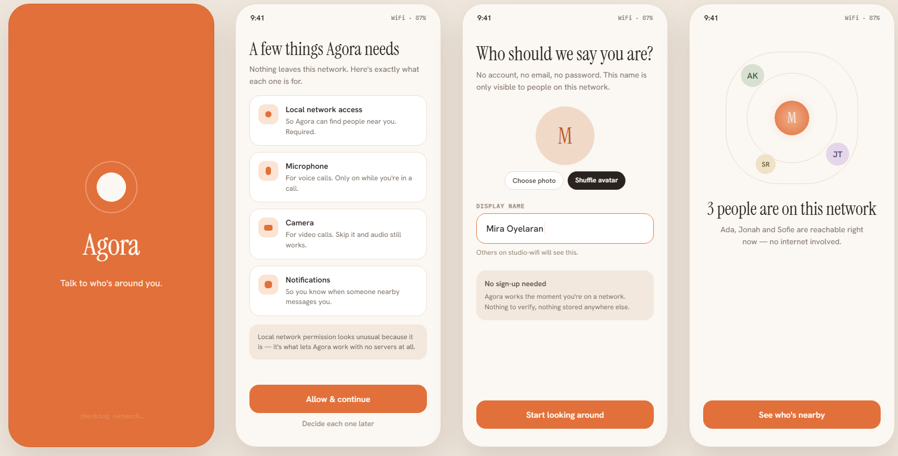

# Agora

**Agora is not "another messaging app."** It's private, serverless, local communication for places where internet connectivity, privacy, or account-based communication is undesirable or unavailable. Find people on the same local network and talk to them instantly — no accounts, no phone numbers, no internet connection required. Discovery, messaging, file sharing, and voice/video calls all work directly, device‑to‑device, over the local network. Internet, when it happens to be available, is treated as a pure bonus (optional cross‑network sync) — never a requirement.

**Where this fits:** campuses and classrooms, conferences, airplanes, hospitals during a network outage, disaster/emergency response, remote sites (construction, camps, villages), factories and warehouses, LAN parties, and any privacy-sensitive gathering where a central server is a liability, not a feature.

This repository holds both the **visual design** — a single interactive canvas covering all 37 screens of the app — and the **working backend** for the phases built so far.



## Why "Agora"

In ancient Greek city-states, the *agora* was the open public square — the place people physically gathered to talk and trade, with no ruler or central authority presiding over it. That's the shape of this app: no server sitting in the middle of your conversation, no account system, no company routing your messages through its own infrastructure. Just people finding each other in the same local space — here, the same WiFi network — and talking directly, the way the agora itself worked: a local gathering place, not a cloud platform.

## View the design

Open [`index.html`](index.html) in any browser — it's a self-contained page (no build step, no install).

## Desktop app design

The plan is an Electron shell around this same design, talking to the local API (see Build status below) — a full native-feeling window, not a resized phone screen:


## Run the backend

```bash
cd backend
python -m venv venv && venv\Scripts\activate   # or: source venv/bin/activate
pip install -r requirements.txt

# terminal 1
python -m app.cli_chat --name Alice --port 8001
# terminal 2
python -m app.cli_chat --name Bob --port 8002
```

Once both are running, type `peers` in either one to see the other appear on the network, then `Bob hey` (or `Alice hey`) to send a message, then `history Bob` to watch it move from `pending` → `sent` → `delivered`. Try `send Bob <file path>` too — the other side gets a live accept/decline prompt (with a distinct warning if it's an executable), and `files Bob` shows transfer status. No server, no config — the two processes find and talk to each other directly.

There's also a local HTTP/WebSocket API (`app.api`) for driving this programmatically instead of through the CLI — `uvicorn app.api:app --host 127.0.0.1 --port 5001` exposes `GET /peers`, `POST /messages`, `POST /files/send`, and a `WS /events` stream. This is what the eventual desktop UI talks to.

## Build status

This repo is the design; the app itself is being built in step with it, phase by phase. Current status:

| Phase | Status | Design screens |
|---|---|---|
| 1 — Discovery | ✅ done | 1.1–1.4c (onboarding), 3.1–3.3 (nearby) |
| 2 — Messaging | ✅ done | 4.1–4.5, 7.2 |
| 2B — File sharing | ✅ done | 8.1–8.7 |
| 3 — Calling | ⏳ not started | 5.1–5.6, 5.2b, 7.3, 7.4 |
| 4 — Hybrid mode | ⏳ not started | 6.2, 7.1 |
| 5 — Polish | ⏳ not started | 6.1, 6.3–6.5 |

- **Discovery** — devices find each other on the LAN via mDNS, with a UDP broadcast fallback for networks that filter it. Verified: peers appear/disappear live as they join and leave.
- **Messaging** — direct WebSocket between peers (no server in between), messages persisted locally per device, with sent/delivered acknowledgment. Verified: a message sent to a peer that just dropped off the network is held and delivered exactly once, in order, once that peer reappears.
- **File sharing** — any file type, offer/accept consent before anything moves, a dedicated connection per transfer so large files stream straight to disk, receiver-side hash verification, and resume from the exact byte offset after a drop. Executable/installable files get a distinctly stronger warning.
- A local API layer (`app.api`, FastAPI) now wraps all of the above for a future UI to call instead of a human typing into the CLI.
- Everything below File sharing is designed (see the screens above) but not yet built.

## What's designed here

| Section | Screens |
|---|---|
| **Onboarding** | Splash, permissions (with plain-language reasons for each), profile setup (no sign-up), first-run network check (found / empty / blocked states) |
| **Nearby** | Live peer list with presence indicators, empty/scanning state, peer quick-actions, discovery troubleshooting |
| **Chats** | Conversation list, 1:1 chat with delivery ticks, group chat, new chat/group creation, per-conversation info |
| **Calls** | Outgoing/incoming call, call collision handling, active audio/video call, call-ended summary, call history |
| **Settings** | Network mode (LAN-only vs. hybrid), privacy & security, notifications, about/help |
| **System states** | Connectivity change banners, router (AP) isolation detected, peer disconnected mid-call |
| **File sharing** | Send confirmation, transfer progress, a distinct security interstitial for installable files (APKs, etc.), shared-files list |

## Design direction

- **Mood:** warm and local — "same room," not corporate cloud software.
- **Palette:** warm cream neutrals with a terracotta accent, standing in for presence/signal rather than a cold tech blue.
- **Type:** Instrument Serif for display headings, Hanken Grotesk for interface text, IBM Plex Mono for technical/metadata labels.
- **Signature motif:** a recurring "presence pulse" used anywhere a peer is shown as reachable right now — since the entire value of the app is "who can I actually talk to on this network."

## Why this matters for the app itself

Every screen here is tied to a concrete part of how Agora actually works underneath — for example, the peer list reflects live mDNS/UDP discovery results, delivery ticks map to a real send → sent → delivered acknowledgment protocol over direct WebSocket connections, and the file-sharing security interstitial exists because installable files (APKs, executables) are treated as a genuine security decision, not a routine download. This design isn't decoration bolted onto a backend afterward — the backend (peer discovery and LAN messaging) is being built in step with it, and is already working end-to-end in testing.
