# Agora

**Agora is not "another messaging app."** It's private, serverless, local communication for places where internet connectivity, privacy, or account-based communication is undesirable or unavailable. Find people on the same local network and talk to them instantly: no accounts, no phone numbers, no internet connection required. Discovery, messaging, file sharing, and voice/video calls all work directly, device‑to‑device, over the local network. Internet, when it happens to be available, is treated as a pure bonus (optional cross‑network sync), never a requirement.

**Where this fits:** campuses and classrooms, conferences, airplanes, hospitals during a network outage, disaster/emergency response, remote sites (construction, camps, villages), factories and warehouses, LAN parties, and any privacy-sensitive gathering where a central server is a liability, not a feature.

This repository holds the **visual design** (a single interactive canvas covering all 37 mobile screens plus a dedicated desktop section), the **working backend** for the phases built so far, and a **real desktop app** (React UI rebuilt to match the actual design file pixel-for-pixel, running inside Electron with the Python backend spawned automatically, not a browser tab, not mockups).

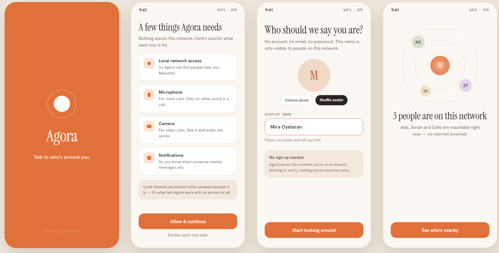

## Why "Agora"

In ancient Greek city-states, the *agora* was the open public square: the place people physically gathered to talk and trade, with no ruler or central authority presiding over it. That's the shape of this app: no server sitting in the middle of your conversation, no account system, no company routing your messages through its own infrastructure. Just people finding each other in the same local space, here the same WiFi network, and talking directly, the way the agora itself worked: a local gathering place, not a cloud platform.

## View the design

Open [`design/index.html`](design/index.html) in any browser. It's a self-contained page (no build step, no install).

## Desktop app design

The plan is an Electron shell around this same design, talking to the local API (see Build status below): a full native-feeling window, not a resized phone screen:

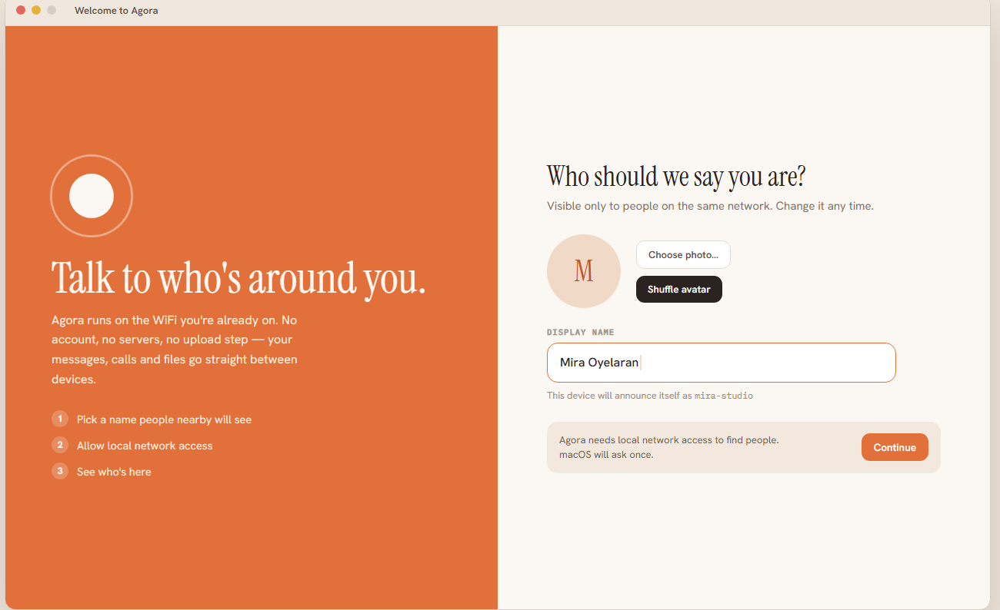

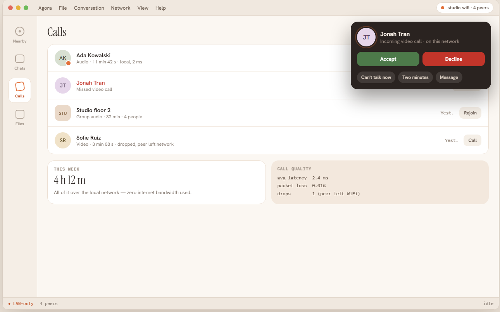

## Run the backend

```bash
cd backend
python -m venv venv && venv\Scripts\activate   # or: source venv/bin/activate
pip install -r requirements.txt

# terminal 1
python -m app.cli_chat --name Alice --port 8001
# terminal 2
python -m app.cli_chat --name Bob --port 8002
```

Once both are running, type `peers` in either one to see the other appear on the network, then `Bob hey` (or `Alice hey`) to send a message, then `history Bob` to watch it move from `pending` → `sent` → `delivered`. Try `send Bob <file path>` too: the other side gets a live accept/decline prompt (with a distinct warning if it's an executable), and `files Bob` shows transfer status. No server, no config: the two processes find and talk to each other directly.

There's also a local HTTP/WebSocket API (`app.api`) for driving this programmatically instead of through the CLI: `uvicorn app.api:app --host 127.0.0.1 --port 5001` exposes `GET /peers`, `POST /messages`, `POST /files/send`, and a `WS /events` stream. This is what the desktop UI below actually talks to.

## Run the desktop app

The real thing - a frameless Electron window with its own custom titlebar, spawning the Python backend automatically. No terminal to babysit, no browser tab.

```bash
cd frontend
npm install
npm run electron:dev
```

That's it - Electron starts the backend for you (writing its data to a proper per-user app-data folder) and opens the real app window. `npm run electron:build` produces two files under `frontend/release`: `Agora Setup <version>.exe`, a normal Windows installer, and `Agora <version>.exe`, a portable build that runs directly with no installation, no admin rights, and no Start Menu entry.

Prefer just the web UI in a browser tab for development? That still works:

```bash
cd frontend
echo VITE_API_BASE=http://127.0.0.1:5001 > .env
npm run dev
```

(with a backend already running on port 5001 via `app.api`, as above).

## Build status

This repo is the design; the app itself is being built in step with it, phase by phase. Current status:

| Phase | Status | Design screens |
|---|---|---|
| 1: Discovery | ✅ done | 1.1–1.4c (onboarding), 3.1–3.3 (nearby) |
| 2: Messaging | ✅ done | 4.1–4.5, 7.2 |
| 2B: File sharing | ✅ done | 8.1–8.7 |
| 3: Calling | ✅ done | 5.1–5.6, 5.2b, 7.3, 7.4 |
| 4: Hybrid mode | ❌ removed by design (LAN/WiFi-only, always; internet availability is never checked) | ~~6.2, 7.1~~ |
| 5: Polish | ⏳ not started | 6.1, 6.3–6.5 |

- **Discovery**: devices find each other on the LAN via mDNS, with a UDP broadcast fallback for networks that filter it. Verified: peers appear/disappear live as they join and leave.
- **Messaging**: direct WebSocket between peers (no server in between), messages persisted locally per device, with sent/delivered acknowledgment. Verified: a message sent to a peer that just dropped off the network is held and delivered exactly once, in order, once that peer reappears. Delete for me, delete for everyone (with the same held-and-retried-on-reconnect guarantee if the other person is briefly offline), clearing a whole conversation or the call history, and forwarding a message or a received file, are all built and working.
- **File sharing**: any file type, offer/accept consent before anything moves, a dedicated connection per transfer so large files stream straight to disk, receiver-side hash verification, and resume from the exact byte offset after a drop. Executable/installable files get a distinctly stronger warning, plus bandwidth-sharing that measurably throttles transfers while a call is active.
- **Calling**: real peer-to-peer WebRTC audio and video (no STUN/TURN needed, since the same subnet never requires it), signaling relayed over the existing WebSocket rather than any cloud service. Deterministic collision handling if both sides call each other at once, a persisted call history, and an incoming-call toast that shows up regardless of which screen you're on.
- A local API layer (`app.api`, FastAPI) wraps all of the above for the UI to call instead of a human typing into a CLI.

**Desktop app**: a real Electron window, not a browser tab:

| Piece | Status |
|---|---|
| Local API layer | ✅ done |
| UI rebuilt to match the actual design file (not an approximation) | ✅ done |
| Nearby, Chats, Files, Calls: all live, all wired to the real backend | ✅ done |
| Electron packaging (frameless window, auto-spawned backend, Windows installer) | ✅ done |
| Group chat, group calling, group file/image sharing | ✅ done (calling capped at 4 people, full mesh, see Architecture below) |

Not built: raising the group-calling cap past 4 people, which needs a real relay design (discussed and deliberately deferred, not a missing feature so much as a scaling decision not yet needed), and offline delivery/delete/forward for group messages (all exist for 1:1 chat already).

## Architecture

There is no server anywhere in this system, not a hidden one, not an optional one. Every device runs the exact same stack. Two devices on the same LAN are peers, full stop:

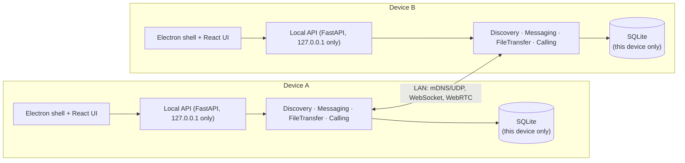
```mermaid
flowchart LR
    subgraph A["Device A"]
        A1["Electron shell + React UI"] --> A2["Local API (FastAPI, 127.0.0.1 only)"]
        A2 --> A3["Discovery · Messaging · FileTransfer · Calling"]
        A3 --> A4[("SQLite\n(this device only)")]
    end

    subgraph B["Device B"]
        B1["Electron shell + React UI"] --> B2["Local API (FastAPI, 127.0.0.1 only)"]
        B2 --> B3["Discovery · Messaging · FileTransfer · Calling"]
        B3 --> B4[("SQLite\n(this device only)")]
    end

    A3 <--> |"LAN: mDNS/UDP, WebSocket, WebRTC"| B3
```

Each device's local API is bound to `127.0.0.1`. That's how that device's own UI talks to its own backend, never reachable from other peers. All actual peer-to-peer traffic (discovery, messages, files, calls) goes out over separate LAN-facing sockets, entirely independent of that loopback API.

### Discovery

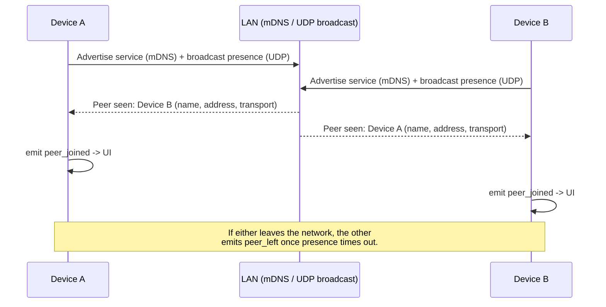
```mermaid
sequenceDiagram
    participant A as Device A
    participant LAN as LAN (mDNS / UDP broadcast)
    participant B as Device B

    A->>LAN: Advertise service (mDNS) + broadcast presence (UDP)
    B->>LAN: Advertise service (mDNS) + broadcast presence (UDP)
    LAN-->>A: Peer seen: Device B (name, address, transport)
    LAN-->>B: Peer seen: Device A (name, address, transport)
    A->>A: emit peer_joined -> UI
    B->>B: emit peer_joined -> UI
    Note over A,B: If either leaves the network, the other<br/>emits peer_left once presence times out.
```

mDNS is the primary path; UDP broadcast is the fallback for networks that filter mDNS traffic. Both are checked, so a peer only needs to be reachable by one of them to show up.

### Messaging

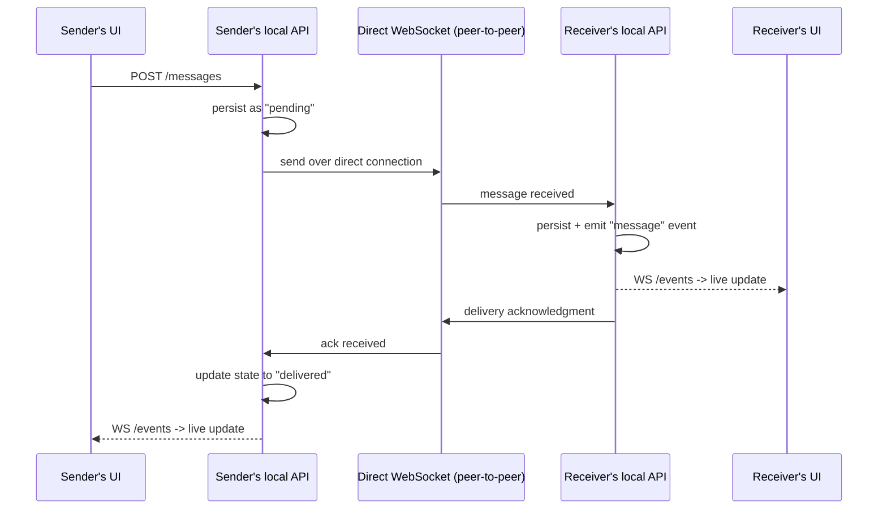
```mermaid
sequenceDiagram
    participant UI as Sender's UI
    participant API as Sender's local API
    participant WS as Direct WebSocket (peer-to-peer)
    participant PeerAPI as Receiver's local API
    participant PeerUI as Receiver's UI

    UI->>API: POST /messages
    API->>API: persist as "pending"
    API->>WS: send over direct connection
    WS->>PeerAPI: message received
    PeerAPI->>PeerAPI: persist + emit "message" event
    PeerAPI-->>PeerUI: WS /events -> live update
    PeerAPI->>WS: delivery acknowledgment
    WS->>API: ack received
    API->>API: update state to "delivered"
    API-->>UI: WS /events -> live update
```

If the peer is offline, the message stays `pending` and is delivered exactly once, in order, the next time that peer is seen. No server queues it in between; the sender's own device holds it.

### File transfer

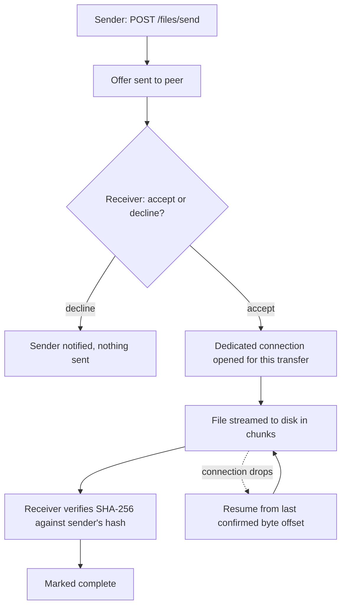
```mermaid
flowchart TD
    S["Sender: POST /files/send"] --> O["Offer sent to peer"]
    O --> D{"Receiver: accept or decline?"}
    D -- decline --> X["Sender notified, nothing sent"]
    D -- accept --> C["Dedicated connection opened for this transfer"]
    C --> ST["File streamed to disk in chunks"]
    ST --> H["Receiver verifies SHA-256 against sender's hash"]
    H --> DN["Marked complete"]
    ST -. connection drops .-> R["Resume from last confirmed byte offset"]
    R --> ST
```

Executable/installable files get an extra security interstitial (two required checkboxes plus a countdown) before the accept path is even reachable. See [Security posture](#security-posture-honest-as-of-now).

### Calling

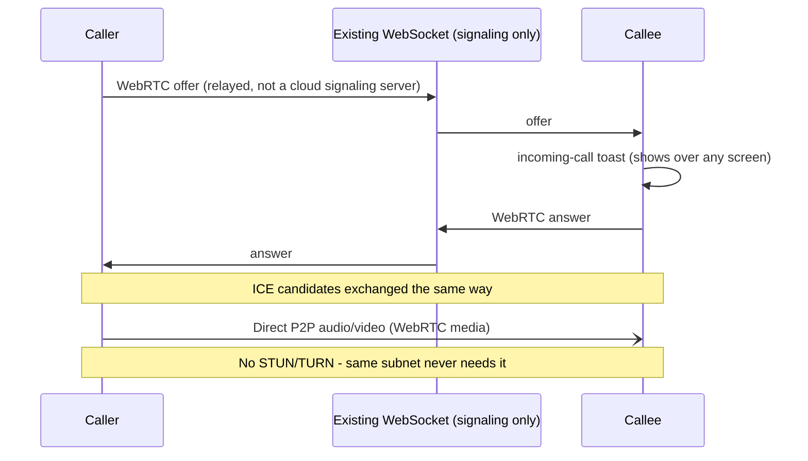
```mermaid
sequenceDiagram
    participant A as Caller
    participant WS as Existing WebSocket (signaling only)
    participant B as Callee

    A->>WS: WebRTC offer (relayed, not a cloud signaling server)
    WS->>B: offer
    B->>B: incoming-call toast (shows over any screen)
    B->>WS: WebRTC answer
    WS->>A: answer
    Note over A,B: ICE candidates exchanged the same way
    A-)B: Direct P2P audio/video (WebRTC media)
    Note over A,B: No STUN/TURN - same subnet never needs it
```

Signaling (offer/answer/ICE) piggybacks on the same direct WebSocket messaging already uses; there's no separate signaling server, cloud or otherwise. Once connected, audio/video flows directly between the two devices.

### Encryption

There's no central server here to issue TLS certificates from - this is peer-to-peer with no authority anywhere, ever. The design that fits is the one SSH and Signal both use instead: every device has its own long-lived identity, any two devices derive a shared secret independently, and trust is built up the first time you meet someone rather than vouched for by a third party. Two separate keypairs, generated once on first run and never regenerated:

| Keypair | Algorithm | Used for | Ever leaves the device? |
|---|---|---|---|
| Encryption identity | X25519 | Deriving the shared secret two peers encrypt with | Only the public half, broadcast via discovery |
| Signing identity | Ed25519 | Proving a discovery announcement really came from the peer_id it claims | Only the public half, broadcast via discovery |

Deliberately two separate keys, not one reused for both jobs - a Diffie-Hellman key and a signing key are different mathematical tools, and mixing their purposes is a real cryptographic engineering mistake independent of whether any specific attack exploits it.

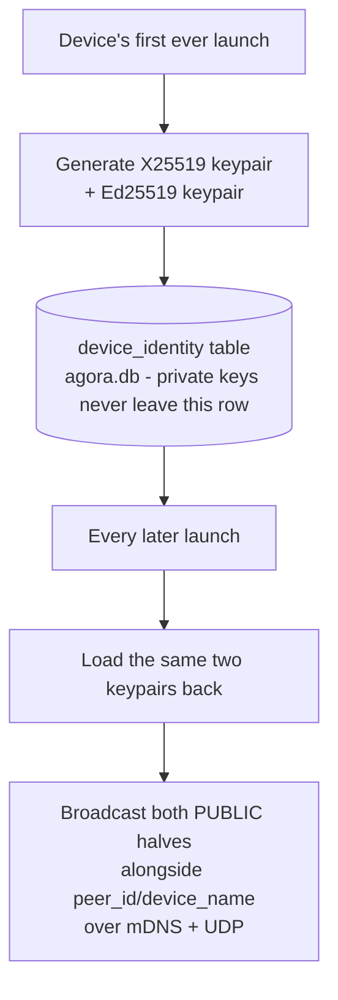
```mermaid
flowchart TD
    FIRST["Device's first ever launch"] --> GEN["Generate X25519 keypair\n+ Ed25519 keypair"]
    GEN --> STORE[("device_identity table\nagora.db - private keys never leave this row")]
    STORE --> EVERY["Every later launch"]
    EVERY --> LOAD["Load the same two keypairs back"]
    LOAD --> BCAST["Broadcast both PUBLIC halves\nalongside peer_id/device_name\nover mDNS + UDP"]
```

**1. Signed discovery - proving an announcement is really from who it claims.** Every mDNS TXT record and UDP broadcast packet is signed with the sender's Ed25519 key, over exactly the fields that matter (`peer_id`, `address`, `port`, encryption `public_key` - not the cosmetic device name, which can legitimately change). A receiver verifies the signature and pins the signing key to that peer_id the first time it's seen, before the announcement is ever allowed to affect the live peer list:

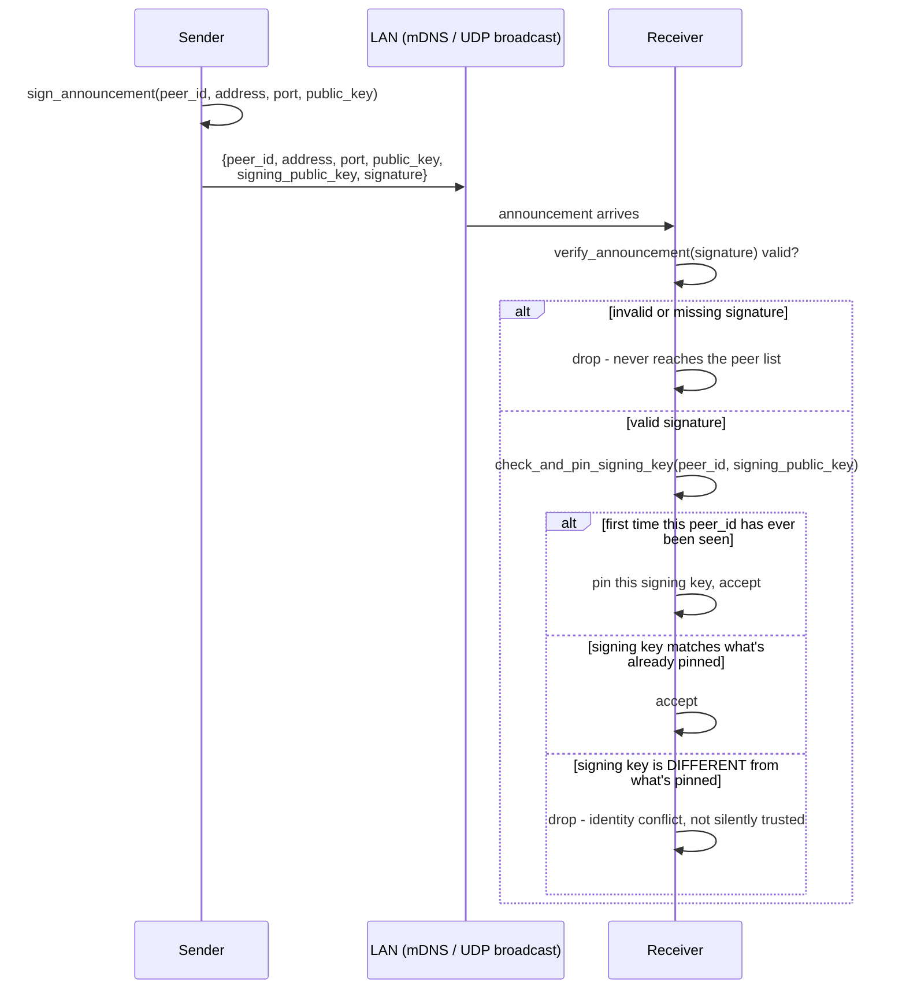
```mermaid
sequenceDiagram
    participant Sender
    participant LAN as LAN (mDNS / UDP broadcast)
    participant Receiver

    Sender->>Sender: sign_announcement(peer_id, address, port, public_key)
    Sender->>LAN: {peer_id, address, port, public_key,<br/>signing_public_key, signature}
    LAN->>Receiver: announcement arrives
    Receiver->>Receiver: verify_announcement(signature) valid?
    alt invalid or missing signature
        Receiver->>Receiver: drop - never reaches the peer list
    else valid signature
        Receiver->>Receiver: check_and_pin_signing_key(peer_id, signing_public_key)
        alt first time this peer_id has ever been seen
            Receiver->>Receiver: pin this signing key, accept
        else signing key matches what's already pinned
            Receiver->>Receiver: accept
        else signing key is DIFFERENT from what's pinned
            Receiver->>Receiver: drop - identity conflict, not silently trusted
        end
    end
```

This is what actually stops a forged broadcast: an attacker can self-sign their own fake announcement with a freshly-generated keypair - the signature itself is perfectly valid - but they can't produce a signature that matches a signing key already pinned to someone else's peer_id. Confirmed by directly attacking it: a real adversarial test flooded exactly this kind of forged packet at a live device and it was rejected every time (see [Known security gaps](#security-posture-honest-as-of-now)).

**2. Shared secret and directional keys - what actually encrypts a message.** Once two devices know each other's real (verified) X25519 public key, each independently computes the same shared secret with nobody ever transmitting it, then splits it into two separate keys - one for each direction:

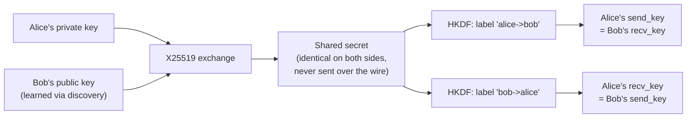
```mermaid
flowchart LR
    APRIV["Alice's private key"] --> DH1["X25519 exchange"]
    BPUB["Bob's public key\n(learned via discovery)"] --> DH1
    DH1 --> SECRET["Shared secret\n(identical on both sides,\nnever sent over the wire)"]
    SECRET --> HKDF1["HKDF: label 'alice->bob'"]
    SECRET --> HKDF2["HKDF: label 'bob->alice'"]
    HKDF1 --> SENDKEY["Alice's send_key\n= Bob's recv_key"]
    HKDF2 --> RECVKEY["Alice's recv_key\n= Bob's send_key"]
```

A single shared key used for both directions was tried first, and an actual reflection attack confirmed it was exploitable: a message Alice encrypted for Bob could be captured and bounced straight back at Alice's own connection, and she'd accept it as genuinely coming from Bob. Splitting the secret into two labelled, directional keys closes this - a blob valid in one direction can never be mistaken for the other, even between the same two devices.

**3. Every real frame, encrypted and authenticated.** `"hello"` (just an identity announcement, no secret) is the only frame ever sent as plaintext; everything after it - chat messages, delivery acks, file-transfer chunks, call signaling (SDP/ICE) - is ChaCha20-Poly1305 authenticated encryption, sent as a binary WebSocket frame instead of a plaintext one:

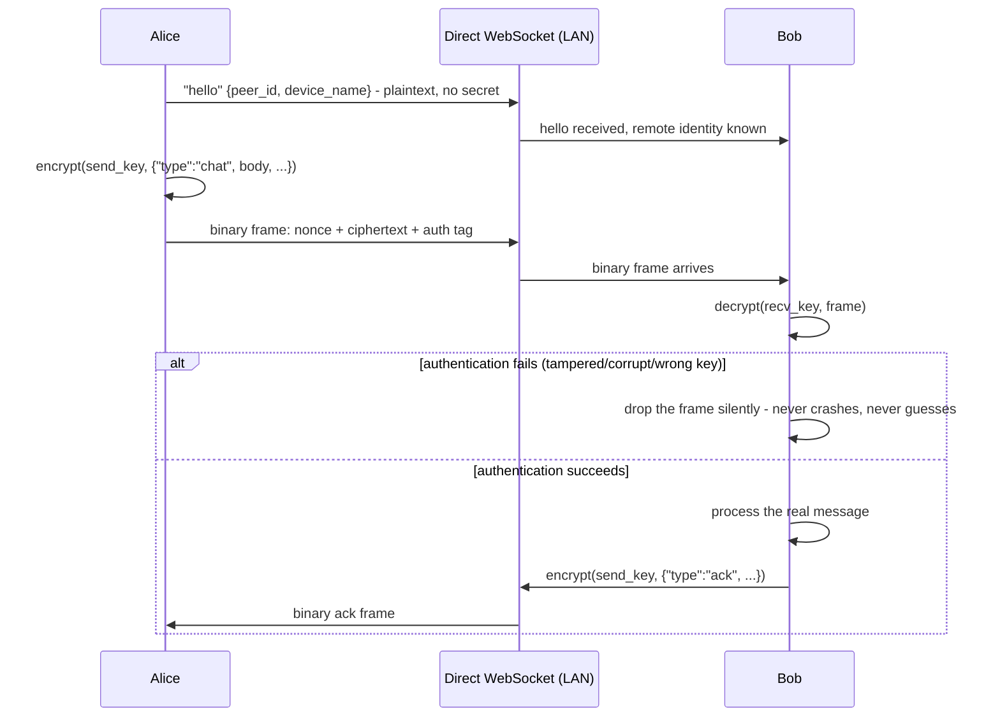
```mermaid
sequenceDiagram
    participant A as Alice
    participant NET as Direct WebSocket (LAN)
    participant B as Bob

    A->>NET: "hello" {peer_id, device_name} - plaintext, no secret
    NET->>B: hello received, remote identity known
    A->>A: encrypt(send_key, {"type":"chat", body, ...})
    A->>NET: binary frame: nonce + ciphertext + auth tag
    NET->>B: binary frame arrives
    B->>B: decrypt(recv_key, frame)
    alt authentication fails (tampered/corrupt/wrong key)
        B->>B: drop the frame silently - never crashes, never guesses
    else authentication succeeds
        B->>B: process the real message
        B->>NET: encrypt(send_key, {"type":"ack", ...})
        NET->>A: binary ack frame
    end
```

Authenticated, not just confidential: a tampered or forged frame fails to decrypt and is dropped outright, rather than being accepted with corrupted content. The file-transfer TCP channel (a separate socket from the messaging WebSocket) gets the identical treatment per chunk, length-prefixed so the receiver reads exact encrypted blobs - which also closes a real gap beyond confidentiality, since that socket has no identity check of its own otherwise: without the right key, nothing a third party sends to it will ever decrypt.

**4. Trust-on-first-use for the encryption key itself.** Separately from the signing-key pinning above (which protects discovery), `known_peers` also remembers a peer_id's encryption public key the first time real communication happens with them. If that key ever changes later, it's surfaced as a real, dismissible warning in the app rather than silently trusted or silently blocked - the app doesn't decide for you whether it's a genuine reinstall on their end or someone else now claiming that identity.

None of this covers WebRTC call *media* (audio/video) - that path is always DTLS-SRTP encrypted by the browser/Electron engine itself, with no way to turn it off, so there was never a gap there to close. See [Security posture](#security-posture-honest-as-of-now) for what this design still doesn't protect against.

### Network communication: every port and protocol in play

Nothing here is abstracted behind a magic "cloud" box. This is the literal set of sockets each device opens:

| Purpose | Protocol | Port | Bound to |
|---|---|---|---|
| Local API (this device's UI ↔ its own backend) | HTTP + WebSocket (FastAPI) | `5321` (desktop app) / `5001`, `5002`, … (CLI dev) | `127.0.0.1` only, never reachable from other peers |
| Peer discovery (primary) | mDNS/Zeroconf, service type `_lanchat._tcp.local.` | OS/library-managed mDNS port | `0.0.0.0` (LAN) |
| Peer discovery (fallback) | UDP broadcast | `42424` | `0.0.0.0` (LAN) |
| Peer-to-peer messaging | WebSocket, direct device-to-device, no relay | the discovery-advertised port (e.g. `8420` desktop, `8001`/`8002` CLI) | `0.0.0.0` (LAN) |
| File transfer | Raw TCP, one dedicated connection per transfer | OS-assigned ephemeral port, told to the sender over the messaging WebSocket | `0.0.0.0` (LAN) |
| Calling (signaling) | Same messaging WebSocket, carrying `offer`/`answer`/ICE candidates as JSON | same as messaging port | `0.0.0.0` (LAN) |
| Calling (media) | WebRTC (SRTP/UDP), direct peer-to-peer | ICE-negotiated ephemeral port | LAN, no STUN/TURN needed |

The messaging WebSocket does triple duty deliberately: chat, file-transfer negotiation, and call signaling all ride the same already-open connection to a peer, rather than opening a new socket type for every feature. Only bulk file bytes get their own dedicated connection, since streaming large data over the same socket as control messages would head-of-line-block everything else.

### Storage & database

Every device keeps its own SQLite file. There is no shared, synced, or central database anywhere:

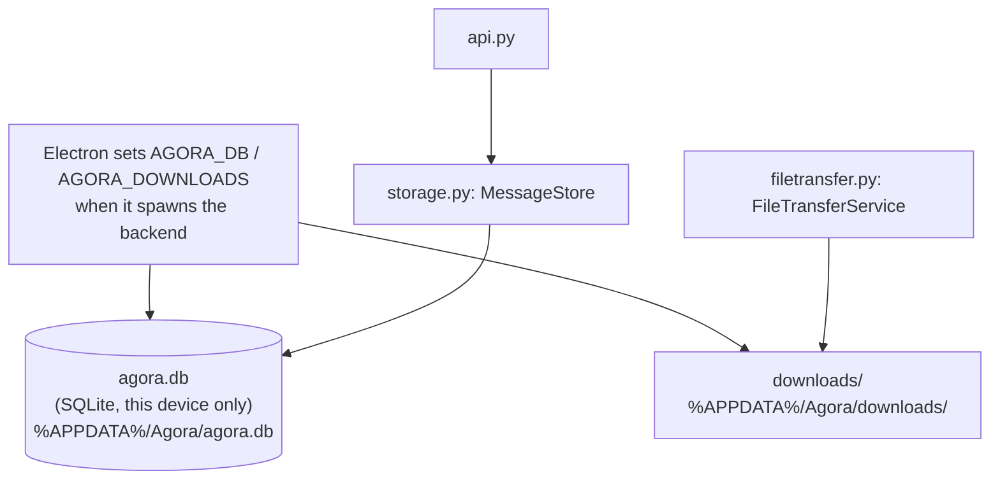
```mermaid
flowchart TD
    ENV["Electron sets AGORA_DB / AGORA_DOWNLOADS\nwhen it spawns the backend"]
    ENV --> DB[("agora.db\n(SQLite, this device only)\n%APPDATA%/Agora/agora.db")]
    ENV --> DL["downloads/\n%APPDATA%/Agora/downloads/"]
    MS["storage.py: MessageStore"] --> DB
    FT["filetransfer.py: FileTransferService"] --> DL
    API["api.py"] --> MS
```

Five tables make up the whole schema, one row per message/file/call/peer/held-delete, on whichever device sent or received it:

| `messages` | `files` | `calls` |
|---|---|---|
| `msg_id` (PK), `peer_id`, `direction` (sent/received), `body`, `status` (`pending→sent→delivered`, or `received`/`failed`), `ts` | `transfer_id` (PK), `peer_id`, `direction`, `filename`, `size`, `sha256`, `is_executable`, `status`, `saved_path`, `ts` | `call_id` (PK), `peer_id`, `direction`, `media` (audio/video), `status`, `started_at`, `ended_at`, `duration` |

| `known_peers` | `pending_deletes` |
|---|---|
| `peer_id` (PK), `name`, `last_seen`: a peer's display name outlives their live discovery session, so a conversation still shows a real name once they've gone offline, not just while they're on the network right now | `msg_id` (PK), `peer_id`, `ts`: a "delete for everyone" that couldn't reach the peer immediately, retried automatically once they're back online, the same guarantee a normal held message already has |

Every read/write opens a short-lived connection on a worker thread (`asyncio.to_thread`) rather than sharing one connection across coroutines: simple, and correct for what is, per device, low-volume traffic. Writes are `INSERT OR REPLACE`, so a status update (`pending` → `delivered`) is just the same row rewritten, not a new one appended.

### Sending a message, in full detail

The "Messaging" diagram above is the concept; this is the actual code path, function by function, including the real WebSocket message types (`chat`, `ack`) used on the wire:

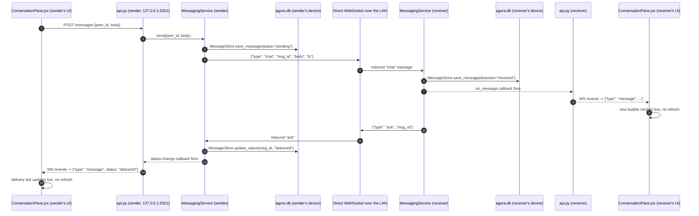
```mermaid
sequenceDiagram
    autonumber
    participant UI_A as ConversationPane.jsx (sender's UI)
    participant API_A as api.py (sender, 127.0.0.1:5321)
    participant MSVC_A as MessagingService (sender)
    participant DB_A as agora.db (sender's device)
    participant NET as Direct WebSocket over the LAN
    participant MSVC_B as MessagingService (receiver)
    participant DB_B as agora.db (receiver's device)
    participant API_B as api.py (receiver)
    participant UI_B as ConversationPane.jsx (receiver's UI)

    UI_A->>API_A: POST /messages {peer_id, body}
    API_A->>MSVC_A: send(peer_id, body)
    MSVC_A->>DB_A: MessageStore.save_message(status="pending")
    MSVC_A->>NET: {"type": "chat", "msg_id", "body", "ts"}
    NET->>MSVC_B: inbound "chat" message
    MSVC_B->>DB_B: MessageStore.save_message(direction="received")
    MSVC_B-->>API_B: on_message callback fires
    API_B-->>UI_B: WS /events -> {"type": "message", ...}
    UI_B->>UI_B: new bubble renders live, no refresh
    MSVC_B->>NET: {"type": "ack", "msg_id"}
    NET->>MSVC_A: inbound "ack"
    MSVC_A->>DB_A: MessageStore.update_status(msg_id, "delivered")
    MSVC_A-->>API_A: status-change callback fires
    API_A-->>UI_A: WS /events -> {"type": "message", status: "delivered"}
    UI_A->>UI_A: delivery tick updates live, no refresh
```

If the peer is unreachable, the flow stops after step 4. The message sits in `agora.db` as `status="pending"` on the sender's own device (nowhere else) until that peer is seen on the LAN again, at which point a fresh connection is opened and the same flow resumes.

### Desktop packaging

The shipped Windows app isn't a browser tab or a mockup. It's a real Electron process tree:

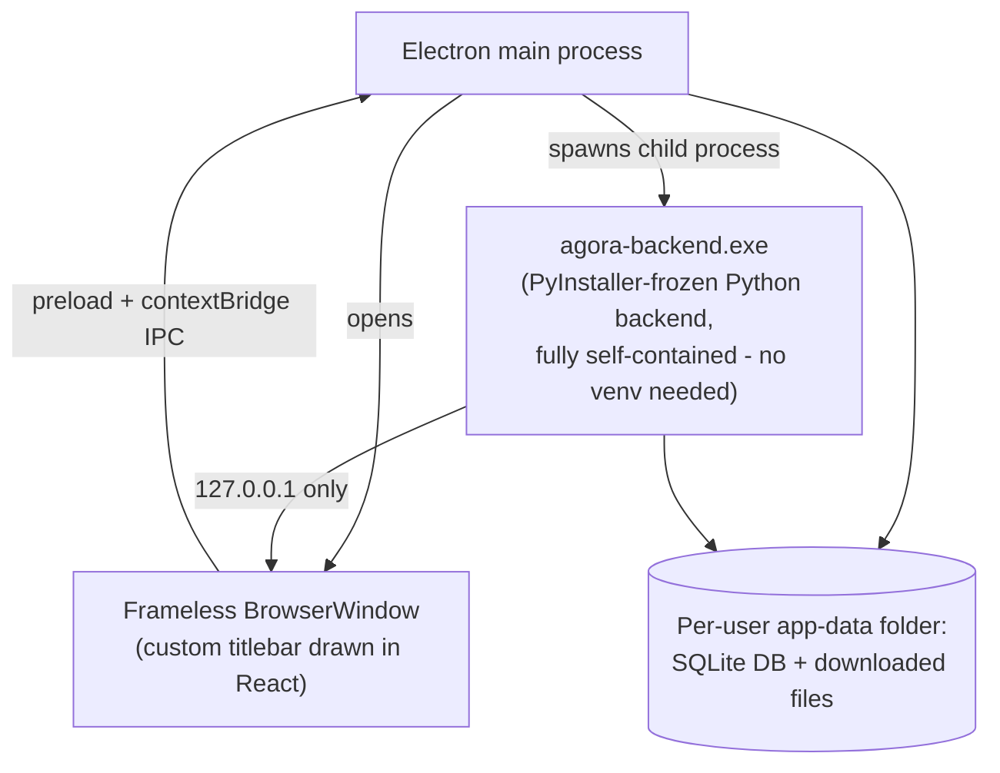
```mermaid
flowchart TD
    E["Electron main process"] -->|spawns child process| BE["agora-backend.exe\n(PyInstaller-frozen Python backend,\nfully self-contained - no venv needed)"]
    E -->|opens| W["Frameless BrowserWindow\n(custom titlebar drawn in React)"]
    W -->|preload + contextBridge IPC| E
    BE -->|127.0.0.1 only| W
    E --> UD[("Per-user app-data folder:\nSQLite DB + downloaded files")]
    BE --> UD
```

In dev mode, Electron spawns the backend via the dev virtualenv's `python.exe` directly for fast iteration. In a packaged build, it spawns the frozen `agora-backend.exe` instead, so the app has no dependency on Python being installed on the machine it's run on.

### Module map

| File | Responsibility |
|---|---|
| `backend/app/discovery.py` | mDNS advertise/browse + UDP broadcast fallback; tracks live peers, fires `peer_joined`/`peer_left`; verifies signed announcements before they reach the peer list |
| `backend/app/crypto_identity.py` | X25519 key exchange + directional key derivation, ChaCha20-Poly1305 encrypt/decrypt, Ed25519 discovery-broadcast signing - see [Encryption](#encryption) |
| `backend/app/messaging.py` | Direct peer-to-peer WebSocket messaging, `pending → sent → delivered` state, encrypts/decrypts every real frame |
| `backend/app/filetransfer.py` | Offer/accept file transfers, chunked streaming (each chunk encrypted), hash verification, resume support |
| `backend/app/calling.py` | WebRTC signaling relay over the existing WebSocket, call state/history |
| `backend/app/storage.py` | Local SQLite persistence: messages, files, call history, device identity keys, pinned peer keys, all per-device |
| `backend/app/api.py` | FastAPI wrapper (127.0.0.1-only) exposing all of the above as REST + `WS /events` for the UI |
| `frontend/electron/main.cjs` | Electron main process: spawns the backend, opens the window, wires IPC window controls |
| `frontend/src/` | React UI (Onboarding, Nearby, Chats, Files, Calls); talks only to the local API, never directly to other peers |

## What's designed here

| Section | Screens |
|---|---|
| **Onboarding** | Splash, permissions (with plain-language reasons for each), profile setup (no sign-up), first-run network check (found / empty / blocked states) |
| **Nearby** | Live peer list with presence indicators, empty/scanning state, peer quick-actions, discovery troubleshooting |
| **Chats** | Conversation list, 1:1 chat with delivery ticks, group chat, new chat/group creation, per-conversation info |
| **Calls** | Outgoing/incoming call, call collision handling, active audio/video call, call-ended summary, call history |
| **Settings** | Network mode (LAN-only vs. hybrid), privacy & security, notifications, about/help |
| **System states** | Connectivity change banners, router (AP) isolation detected, peer disconnected mid-call |
| **File sharing** | Send confirmation, transfer progress, a distinct security interstitial for installable files (APKs, etc.), shared-files list |

## Design direction

- **Mood:** warm and local, "same room," not corporate cloud software.
- **Palette:** warm cream neutrals with a terracotta accent, standing in for presence/signal rather than a cold tech blue.
- **Type:** Instrument Serif for display headings, Hanken Grotesk for interface text, IBM Plex Mono for technical/metadata labels.
- **Signature motif:** a recurring "presence pulse" used anywhere a peer is shown as reachable right now, since the entire value of the app is "who can I actually talk to on this network."

## Security posture (honest, as of now)

- The local API binds to `127.0.0.1` only and its CORS is restricted to the app's own origins. A wildcard wouldn't be safe even on loopback, since any webpage open in any browser could otherwise call it directly with no auth.
- **Peer-to-peer traffic is end-to-end encrypted.** Every device generates its own X25519 keypair on first run and keeps the private half local forever; public keys are broadcast openly alongside peer_id/name over the existing discovery channel. Any two peers derive the same underlying secret independently (X25519 + HKDF), then split it into two distinct, directional keys - one for each side of the conversation, not one shared key reused both ways - and every message, file chunk, and call-signaling frame after that is encrypted with ChaCha20-Poly1305: authenticated, not just confidential, so a tampered or forged frame is detected and dropped rather than accepted. The directional split exists because a single shared key was tried first, and an actual adversarial test confirmed it was reflectable: a captured message sent to a peer could be bounced straight back at its own sender, who would accept it as genuinely coming from the other side. This does not cover call *media* (audio/video), which was always DTLS-SRTP encrypted by the browser/Electron engine itself regardless.
- **Trust-on-first-use identity**, the same model SSH and Signal use since there's no central authority here to issue certificates from: the first time a peer_id is ever seen, its public key is remembered. If that same peer_id later shows up with a *different* key, that's surfaced to you as a real, dismissible security warning rather than silently trusted or silently blocked - it could mean a genuine reinstall on their end, or someone else now claiming that identity, and the app doesn't decide which for you.
- **Discovery broadcasts are signed.** Each device also carries a separate Ed25519 signing keypair (never reused for the X25519 encryption above - a DH key and a signing key are different tools), and every mDNS/UDP discovery announcement is signed with it. A receiver verifies that signature and pins the signing key to that peer_id the first time it's seen, *before* the announcement is ever allowed to affect anything - so a forged broadcast for an already-known peer_id (adversarial testing found this was previously a reliable, repeatable attack: a sustained flood of unsigned forged packets would win that peer_id's entry and redirect its traffic to an attacker's own key) is now rejected outright, whether it's unsigned or self-signed with a freshly-generated attacker key. This still can't protect the very first time a peer_id is ever seen - no trust-on-first-use scheme can, SSH included - so a brand-new contact on a genuinely hostile network still can't be verified out-of-band. Appropriate for a private/trusted LAN, not a hostile one.

## Why this matters for the app itself

Every screen here is tied to a concrete part of how Agora actually works underneath. For example, the peer list reflects live mDNS/UDP discovery results, delivery ticks map to a real send → sent → delivered acknowledgment protocol over direct WebSocket connections, and the file-sharing security interstitial exists because installable files (APKs, executables) are treated as a genuine security decision, not a routine download. This design isn't decoration bolted onto a backend afterward. The backend (peer discovery and LAN messaging) is being built in step with it, and is already working end-to-end in testing.
