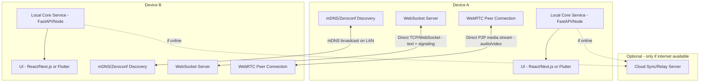

# LAN-First Chat & Call App — Architecture + Build Plan + Coding Prompt

A messaging + voice/video calling app that works over a local WiFi network with **zero internet dependency**, and optionally syncs/upgrades to internet mode when available.

---

## 1. Architecture Overview



**Key principle:** every device runs the *same* local service. There is no client/server split — each peer is both. Discovery finds peers, WebSocket handles text + signaling, WebRTC handles media, and the cloud layer is a pure optional upgrade, never a dependency.

---

## 2. Component Breakdown

| Layer | Responsibility | Suggested tech |
|---|---|---|
| Discovery | Find peers on the same LAN without manual IP entry | `zeroconf` (Python) / mDNS |
| Local transport | Reliable messaging + signaling between peers | WebSocket server per device (FastAPI `websockets` or Node `ws`) |
| Calling | Audio/video between peers with no STUN/TURN needed (same subnet, no NAT) | WebRTC, signaling routed over the local WebSocket instead of a cloud signaling server |
| Connectivity mode manager | Detect internet up/down, switch behavior | Small watchdog pinging a known host + fallback to LAN-only |
| UI | Chat + call interface | Next.js/React (browser) or Flutter (native, avoids browser WebRTC/mDNS permission quirks) |
| Optional cloud layer | Sync history / cross-network presence when online | Any backend you already know (FastAPI + Postgres) |

---

## 3. Phased Build Plan

### Phase 1 — Peer Discovery (weekend)
- Each device announces itself via mDNS/Zeroconf with a service name, device name, and local IP/port.
- Build a peer list UI showing everyone currently visible on the LAN.
- Handle peers joining/leaving gracefully (TTL/heartbeat).

### Phase 2 — Messaging (few days)
- Each device runs a local WebSocket server.
- On selecting a peer, open a direct WebSocket connection to their advertised IP/port.
- Implement message send/receive, delivery acknowledgment, and basic message ordering.
- Persist chat history locally (SQLite) per device.

### Phase 3 — Calling (the hard part, 2–4 weeks)
- Implement WebRTC peer connections.
- Route signaling (SDP offer/answer, ICE candidates) over the existing local WebSocket instead of a cloud signaling server.
- Since both peers are on the same subnet, no STUN/TURN server is needed — test this assumption early, some routers with client isolation enabled will break it.
- Handle call states: ringing, accepted, declined, ended, peer dropped mid-call.
- Add basic reconnection logic if WiFi hiccups.

### Phase 4 — Hybrid Online/Offline Mode (1–2 weeks)
- Build a connectivity watchdog: periodically check for real internet (not just WiFi association — ping a known external host).
- Design a connection abstraction so the rest of the app doesn't care whether a peer is reached via LAN or via the optional cloud relay.
- When internet drops, fall back to LAN-only automatically and notify the user.
- When internet returns, optionally sync missed messages via the cloud layer.

### Phase 5 — Polish
- Handle multiple peers/group chat.
- Add encryption for messages/calls (even LAN traffic should be encrypted — assume the WiFi isn't trusted).
- Packaging: Electron/Flutter build so this runs as an actual app, not just a browser tab.

---

## 4. Known Hard Edge Cases To Plan For
- Routers with **client/AP isolation** enabled block device-to-device traffic even on the same WiFi — your app needs to detect this and show a clear error rather than silently failing.
- mDNS is sometimes blocked on corporate/public WiFi — plan a UDP broadcast fallback for discovery.
- Two peers both initiating a call to each other simultaneously (call collision) — needs a tie-breaking rule.
- NAT/firewall on the OS itself (Windows Defender Firewall prompts) blocking incoming WebSocket connections — document this for users.

---

## 5. Detailed Prompt (copy-paste into Claude Code or similar)

```
Build a LAN-first chat and calling application with the following requirements:

CORE REQUIREMENT: The app must work fully offline on a local WiFi network with zero
internet dependency for discovery, messaging, or calling. Internet, if available, is
only used as an optional upgrade layer (cross-network sync), never a requirement.

TECH STACK:
- Local service on each device: FastAPI (Python) with WebSocket support
- Peer discovery: zeroconf/mDNS library, broadcasting a custom service type
  (e.g. _lanchat._tcp.local) with device name and port in the TXT record
- Messaging transport: direct WebSocket connection between peers once discovered
- Calling: WebRTC, using the local WebSocket connection as the signaling channel
  (no STUN/TURN — same-subnet peers, no NAT traversal needed)
- Local persistence: SQLite for chat history
- Frontend: [React/Next.js web UI OR Flutter — choose one] communicating with the
  local FastAPI service over localhost

PHASE 1 - DISCOVERY:
- Implement mDNS-based peer announcement and discovery
- Show a live list of peers currently visible on the LAN, updating as peers join/leave
- Handle the case where mDNS is blocked (implement a UDP broadcast fallback)

PHASE 2 - MESSAGING:
- Each device runs a WebSocket server; connecting to a peer means opening a direct
  WebSocket connection to their discovered IP:port
- Implement text messaging with delivery acknowledgment and local persistence
- Handle a peer disconnecting/reconnecting mid-conversation without losing message order

PHASE 3 - CALLING:
- Implement WebRTC audio and video calling between two peers
- Signaling (SDP offer/answer, ICE candidates) must be exchanged over the existing
  local WebSocket connection, not any external signaling server
- Implement call states: ringing, accepted, declined, in-call, ended
- Handle call collision (both peers calling each other at the same instant) with a
  clear tie-breaking rule (e.g. lexicographically smaller peer ID wins and proceeds,
  other side's outgoing call is cancelled)
- Handle a peer dropping off WiFi mid-call gracefully (detect and end call cleanly)

PHASE 4 - HYBRID MODE:
- Implement a connectivity watchdog that distinguishes "connected to WiFi" from
  "has real internet access" (e.g. periodic HTTP HEAD request to a known reliable host,
  with a short timeout, not just checking the network interface state)
- Design the peer connection logic behind an abstraction so the rest of the app doesn't
  need to know whether a peer is reached via direct LAN connection or (optionally,
  if you implement it) a cloud relay for cross-network use
- When internet is lost, the app must fall back to LAN-only mode automatically with
  no user action required, and should surface a subtle UI indicator of current mode

CONSTRAINTS AND EDGE CASES TO HANDLE EXPLICITLY:
- Detect and clearly report when the router has client/AP isolation enabled (peers
  visible via some means but WebSocket/WebRTC connections fail) rather than failing silently
- Encrypt WebSocket messages and verify this doesn't get accidentally treated as a
  trusted network — treat local WiFi as untrusted
- Document OS firewall prompts that may block incoming connections on first run

DELIVERABLES:
1. A working local service (FastAPI) with discovery, messaging, and signaling endpoints
2. A frontend that lists peers, supports 1:1 text chat, and supports 1:1 audio/video calls
3. Clear separation between the LAN transport layer and the UI, so a cloud-sync layer
   can be added later without rewriting the UI
4. A README explaining the network requirements (same subnet, mDNS/UDP allowed,
   firewall exceptions) since these are the most common points of failure for LAN apps

Start by implementing Phase 1 (discovery) end-to-end with a minimal CLI test before
touching any UI, since a broken discovery layer makes everything downstream unusable.
```

---

## 6. Suggested Build Order Reminder
Do not start Phase 3 (calling) until Phase 1 and 2 are rock solid and tested across at least two real devices on the same WiFi (not just localhost/two terminals on one machine — WebRTC/mDNS behavior differs meaningfully across real network interfaces).
