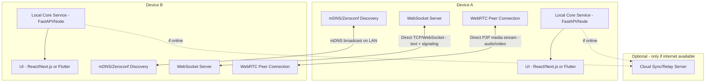

# LAN-First Chat & Call App — Architecture + Build Plan + Coding Prompt

A messaging + voice/video calling app that works over a local WiFi network with **zero internet dependency**, and optionally syncs/upgrades to internet mode when available.

---

## 1. Architecture Overview



**Key principle:** every device runs the *same* local service. There is no client/server split — each peer is both. Discovery finds peers, WebSocket handles text + signaling, WebRTC handles media, and the cloud layer is a pure optional upgrade, never a dependency.

---

## 2. Component Breakdown

| Layer | Responsibility | Suggested tech |
|---|---|---|
| Discovery | Find peers on the same LAN without manual IP entry | `zeroconf` (Python) / mDNS |
| Local transport | Reliable messaging + signaling between peers | WebSocket server per device (FastAPI `websockets` or Node `ws`) |
| File transfer | Send/receive files of any type (docs, images, APKs, game files/ROMs, archives) between peers | Chunked binary transfer over a dedicated TCP connection per transfer (not the chat WebSocket — see Phase 2B), with resume support |
| Calling | Audio/video between peers with no STUN/TURN needed (same subnet, no NAT) | WebRTC, signaling routed over the local WebSocket instead of a cloud signaling server |
| Connectivity mode manager | Detect internet up/down, switch behavior | Small watchdog pinging a known host + fallback to LAN-only |
| UI | Chat + call interface | Next.js/React (browser) or Flutter (native, avoids browser WebRTC/mDNS permission quirks) |
| Optional cloud layer | Sync history / cross-network presence when online | Any backend you already know (FastAPI + Postgres) |

---

## 3. Phased Build Plan

### Phase 1 — Peer Discovery (weekend)
- Each device announces itself via mDNS/Zeroconf with a service name, device name, and local IP/port.
- Build a peer list UI showing everyone currently visible on the LAN.
- Handle peers joining/leaving gracefully (TTL/heartbeat).

### Phase 2 — Messaging (few days)
- Each device runs a local WebSocket server.
- On selecting a peer, open a direct WebSocket connection to their advertised IP/port.
- Implement message send/receive, delivery acknowledgment, and basic message ordering.
- Persist chat history locally (SQLite) per device.

### Phase 2B — File Sharing (few days, right after Phase 2)
- Support sending **any file type** between peers — documents, images/video, APKs, game files/ROMs, archives. No type restriction, since LAN transfer is fast and private, but flag executable/installable types (`.apk`, `.exe`, `.sh`, etc.) distinctly in the UI so a received file is never silently treated as "just another download."
- Use a **separate TCP connection per transfer**, not the chat WebSocket — game/ROM/APK files can be hundreds of MB to a few GB, and buffering that through a WebSocket message (or worse, in memory) doesn't scale. Stream chunks straight to disk on the receiving end.
- Transfer needs its own small protocol: sender proposes (filename, size, hash, mime-guess) over the existing WebSocket, receiver accepts/declines *before* any bytes move, then the TCP stream starts. Show a progress %, transfer speed, and ETA in the UI while it runs.
- Support **resume** after a dropped WiFi connection (Phase 3/4 already assume WiFi hiccups are normal) — chunk-index or byte-offset resume, don't restart large transfers from zero.
- Persist file metadata (name, size, sender, hash, transfer status) in the same local SQLite store as chat history; store the actual bytes in a dedicated per-device "received files" folder, never directly in the DB.
- Explicit consent required before accepting a file — never auto-save, and call out executable/installable file types with an extra confirmation step (installing an unknown APK is a real security decision, not a routine "save attachment" click).

### Phase 3 — Calling (the hard part, 2–4 weeks)
- Implement WebRTC peer connections.
- Route signaling (SDP offer/answer, ICE candidates) over the existing local WebSocket instead of a cloud signaling server.
- Since both peers are on the same subnet, no STUN/TURN server is needed — test this assumption early, some routers with client isolation enabled will break it.
- Handle call states: ringing, accepted, declined, ended, peer dropped mid-call.
- Add basic reconnection logic if WiFi hiccups.

### Phase 4 — Hybrid Online/Offline Mode (1–2 weeks)
- Build a connectivity watchdog: periodically check for real internet (not just WiFi association — ping a known external host).
- Design a connection abstraction so the rest of the app doesn't care whether a peer is reached via LAN or via the optional cloud relay.
- When internet drops, fall back to LAN-only automatically and notify the user.
- When internet returns, optionally sync missed messages via the cloud layer.

### Phase 5 — Polish
- Handle multiple peers/group chat.
- Add encryption for messages/calls (even LAN traffic should be encrypted — assume the WiFi isn't trusted).
- Packaging: Electron/Flutter build so this runs as an actual app, not just a browser tab.

---

## 4. Known Hard Edge Cases To Plan For
- Routers with **client/AP isolation** enabled block device-to-device traffic even on the same WiFi — your app needs to detect this and show a clear error rather than silently failing.
- mDNS is sometimes blocked on corporate/public WiFi — plan a UDP broadcast fallback for discovery.
- Two peers both initiating a call to each other simultaneously (call collision) — needs a tie-breaking rule.
- NAT/firewall on the OS itself (Windows Defender Firewall prompts) blocking incoming WebSocket connections — document this for users.
- Large file transfers (game files, ROMs, APKs can run hundreds of MB to a few GB) saturating the WiFi link and degrading an in-progress call on the same network — consider throttling/pausing large transfers while a call is active.
- A file transfer interrupted mid-way by a WiFi drop needs to resume, not restart — especially painful on multi-GB game files.
- Receiving an installable file (APK/EXE) is a security decision, not a routine download — never auto-open/auto-install; always requires explicit, distinct confirmation from a plain file save.

---

## 5. Detailed Prompt (copy-paste into Claude Code or similar)

```
Build a LAN-first chat and calling application with the following requirements:

CORE REQUIREMENT: The app must work fully offline on a local WiFi network with zero
internet dependency for discovery, messaging, or calling. Internet, if available, is
only used as an optional upgrade layer (cross-network sync), never a requirement.

TECH STACK:
- Local service on each device: FastAPI (Python) with WebSocket support
- Peer discovery: zeroconf/mDNS library, broadcasting a custom service type
  (e.g. _lanchat._tcp.local) with device name and port in the TXT record
- Messaging transport: direct WebSocket connection between peers once discovered
- Calling: WebRTC, using the local WebSocket connection as the signaling channel
  (no STUN/TURN — same-subnet peers, no NAT traversal needed)
- Local persistence: SQLite for chat history
- Frontend: [React/Next.js web UI OR Flutter — choose one] communicating with the
  local FastAPI service over localhost

PHASE 1 - DISCOVERY:
- Implement mDNS-based peer announcement and discovery
- Show a live list of peers currently visible on the LAN, updating as peers join/leave
- Handle the case where mDNS is blocked (implement a UDP broadcast fallback)

PHASE 2 - MESSAGING:
- Each device runs a WebSocket server; connecting to a peer means opening a direct
  WebSocket connection to their discovered IP:port
- Implement text messaging with delivery acknowledgment and local persistence
- Handle a peer disconnecting/reconnecting mid-conversation without losing message order

PHASE 2B - FILE SHARING:
- Support sending any file type between peers (documents, images/video, APKs, game
  files/ROMs, archives) — no type restriction
- Use a dedicated TCP connection per transfer (not the chat WebSocket) so multi-hundred-MB
  or multi-GB files stream straight to disk instead of buffering in memory
- Sender proposes a transfer (filename, size, hash) over the existing WebSocket; receiver
  must explicitly accept before any bytes move — never auto-save
- Show live progress (%, speed, ETA) and support resuming an interrupted transfer after a
  WiFi drop instead of restarting from zero
- Flag executable/installable file types (.apk, .exe, .sh, etc.) with a distinct,
  extra-explicit confirmation step before the receiver can open/install them

PHASE 3 - CALLING:
- Implement WebRTC audio and video calling between two peers
- Signaling (SDP offer/answer, ICE candidates) must be exchanged over the existing
  local WebSocket connection, not any external signaling server
- Implement call states: ringing, accepted, declined, in-call, ended
- Handle call collision (both peers calling each other at the same instant) with a
  clear tie-breaking rule (e.g. lexicographically smaller peer ID wins and proceeds,
  other side's outgoing call is cancelled)
- Handle a peer dropping off WiFi mid-call gracefully (detect and end call cleanly)

PHASE 4 - HYBRID MODE:
- Implement a connectivity watchdog that distinguishes "connected to WiFi" from
  "has real internet access" (e.g. periodic HTTP HEAD request to a known reliable host,
  with a short timeout, not just checking the network interface state)
- Design the peer connection logic behind an abstraction so the rest of the app doesn't
  need to know whether a peer is reached via direct LAN connection or (optionally,
  if you implement it) a cloud relay for cross-network use
- When internet is lost, the app must fall back to LAN-only mode automatically with
  no user action required, and should surface a subtle UI indicator of current mode

CONSTRAINTS AND EDGE CASES TO HANDLE EXPLICITLY:
- Detect and clearly report when the router has client/AP isolation enabled (peers
  visible via some means but WebSocket/WebRTC connections fail) rather than failing silently
- Encrypt WebSocket messages and verify this doesn't get accidentally treated as a
  trusted network — treat local WiFi as untrusted
- Document OS firewall prompts that may block incoming connections on first run
- Throttle or pause large file transfers while a call is active on the same network, so a
  multi-GB transfer doesn't tank call quality
- Treat receiving an installable file (APK/EXE) as a security decision, not a routine
  download — require distinct, explicit confirmation, never auto-open/auto-install

DELIVERABLES:
1. A working local service (FastAPI) with discovery, messaging, signaling, and file-transfer endpoints
2. A frontend that lists peers, supports 1:1 text chat, file sharing of any type, and 1:1 audio/video calls
3. Clear separation between the LAN transport layer and the UI, so a cloud-sync layer
   can be added later without rewriting the UI
4. A README explaining the network requirements (same subnet, mDNS/UDP allowed,
   firewall exceptions) since these are the most common points of failure for LAN apps

Start by implementing Phase 1 (discovery) end-to-end with a minimal CLI test before
touching any UI, since a broken discovery layer makes everything downstream unusable.
```

---

## 6. Suggested Build Order Reminder
Do not start Phase 3 (calling) until Phase 1 and 2 are rock solid and tested across at least two real devices on the same WiFi (not just localhost/two terminals on one machine — WebRTC/mDNS behavior differs meaningfully across real network interfaces).

---

## 7. Standalone Prompt — File Sharing (Phase 2B)

Self-contained; hand this to a coding assistant on its own once discovery (Phase 1) and messaging (Phase 2) are working — it assumes both already exist.

```
Add file sharing to the existing LAN chat app. Discovery (mDNS/UDP peer list) and 1:1
text messaging (direct WebSocket per peer, SQLite history) already work — this adds
the ability to send and receive files of ANY type between two discovered peers.

TRANSPORT:
- Do NOT send file bytes over the existing chat WebSocket. Open a separate, dedicated
  TCP connection per file transfer instead, so a multi-hundred-MB or multi-GB file
  (game files/ROMs and APKs are the extreme case, but don't special-case them — support
  any size) streams straight to disk on the receiving end rather than buffering in memory
  or clogging the chat connection.
- Handshake stays on the existing WebSocket: sender sends a small JSON "file offer"
  message (filename, size in bytes, sha256 hash, guessed mime type). Nothing else happens
  until the receiver responds accept/decline over that same WebSocket.
- On accept, open the dedicated TCP socket and stream the file in chunks (pick a sane
  chunk size, e.g. 64KB-1MB), writing each chunk to disk as it arrives — never buffer the
  whole file in memory.
- Verify the sha256 hash after the full transfer completes; surface a clear "transfer
  corrupted, retry?" state if it doesn't match, rather than silently keeping a bad file.

RESUME:
- If the TCP connection drops mid-transfer (WiFi hiccup), don't restart from zero. Track
  bytes-received on the receiving side, and support resuming from that byte offset when
  the sender reconnects and re-proposes the same transfer (match by hash).

PERSISTENCE:
- Store file metadata (filename, size, sender peer_id, hash, status: pending/accepted/
  transferring/completed/failed) in the same local SQLite database used for chat history,
  linked to the conversation it was sent in.
- Store the actual file bytes in a dedicated per-device "received files" directory —
  never inline in the database.

SAFETY — THIS IS THE PART TO NOT SKIP:
- Never auto-save or auto-open a received file. The receiver must explicitly accept the
  transfer offer before any bytes move, and separately choose "Open"/"Save as" after it
  completes.
- Detect executable/installable file types (.apk, .exe, .sh, .bat, .msi, etc.) by
  extension and flag them distinctly in both the accept-offer step AND the post-transfer
  open step — different visual treatment from a photo or document, with copy that makes
  clear this is an installable program, not a regular file, and that it should only be
  opened if the sender is trusted. Do not add a one-click "install" action — hand off to
  the OS's normal install flow so its own permission/security prompts still apply.

BANDWIDTH SHARING WITH CALLS:
- If a call (Phase 3) is active on the same device when a large transfer is in progress
  (or starts one), pause or throttle the file transfer automatically and show a small
  inline note ("Pausing file transfer to keep call quality up") rather than letting the
  two silently compete for the same WiFi link. Resume the transfer automatically once the
  call ends.

UI STATES TO IMPLEMENT (see ui prompt/agora-ui-pages-prompt.md §4.6 for full detail):
- Sender bubble: "Waiting for [peer] to accept" -> "Sending... 42% - 3.1 MB/s - ~8s left"
  -> "Sent" / "Failed - tap to retry" (retry resumes, doesn't restart)
- Receiver: an explicit accept/decline consent card (name, size, type icon, sender) before
  anything downloads; a visually distinct extra-confirmation card for executable/
  installable types
- In-progress: an embedded progress bar visible to both sides, pause/cancel controls, and
  a "Reconnecting transfer..." state instead of a silent failure if the peer drops off WiFi
- Completed: file-type-specific icon (distinguish image/video/archive/APK/other at a
  glance), filename, size, and an Open/Save-as action
- A per-conversation "Shared files" list (in chat info/settings) showing every file ever
  exchanged in that conversation, independent of scrolling back through messages

Start with small files end-to-end (offer -> accept -> transfer -> hash verify -> save)
before adding resume and the call-bandwidth-sharing logic — get the happy path solid first.
```
